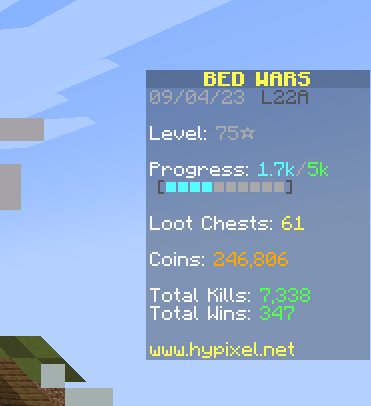
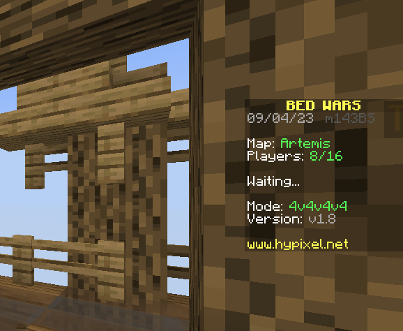
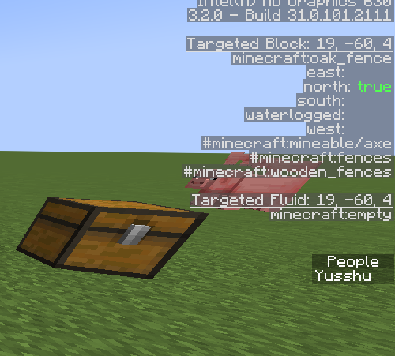

# Sidebar Score Remover

Example resource-pack that removes the score numbers from the Minecraft sidebar
(1.20 - 1.20.1, may work on other versions)

### How does it work?

It modifies the `rendertype_text` core shader, which renders all the text in Minecraft,
and just sets a condition: If the text color is `#FC5454` *(The red color of the numbers in
the side-bar)* and it is near to the right side of the screen, hide it!

However, there are some cases in which another type of text meets the condition, for example,
the `false` text in the debug screen

The distance to the right side of your screen required to meet the condition is specified
[in this file](./assets/minecraft/shaders/core/rendertype_text.fsh), `ScreenSize.x - gl_FragCoord.x < 69`,
where `69` is the distance